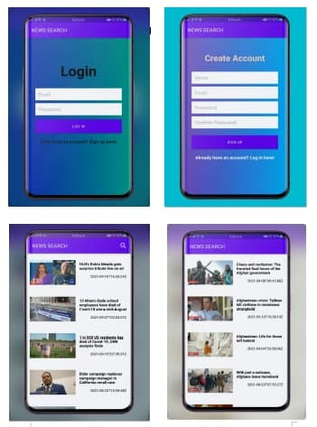

# News Search Application
#### September 6th 2021
#### By **Stephen Njeri**



## Description

```bash

This application will display the latest news articles. Users can search for news from various categories. 
The app will enable users to view news details.
```
## Technologies Used

* Android studio
* Java
* Junit


## Installation

*git clone
* `git remote add origin https://github.com/Steve-njeri/News-search.git`
* `cd Newssearch`

## Launching the Application

```bash
1.Launch the project in Android Studio

```
### Known bugs
* The project is currently not being maintained any more. Contributions are most welcome if you would like to add more modules to the project, you can reach me through my Contacts below.

### License
* This project is protected under [LICENSE](LICENSE)*

Copyright (c) 2021 **STEPHEN NJERI**

